# Sweater Weather

## welome to my sweater weather API project

+ built using
  + rails 5.2.7
  + ruby 2.7.4

### Lets get things running
+ fork and clone this repo
+ run `bundle install` to install all required gems in gemfile
+ run `bundle exec figaro install` to create the required .yml
+ run `rails db:create`
+ `rails db:migrate` to create and migrate the postgresql database

### available endpoints

### get a forecast
returns the forcast weather for a selected location,
includes Current weather, next 8 hours, and next 5 days

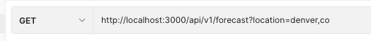

* expample response
```
{
    "data": {
        "id": null,
        "type": "forecast",
        "attributes": {
            "current_weather": {
                "datetime": "2022-04-26T13:46:31.000-04:00",
                "sunrise": "2022-04-26T08:06:38.000-04:00",
                "sunset": "2022-04-26T21:48:30.000-04:00",
                "temp": 66.27,
                "feels_like": 63.36,
                "humidity": 16,
                "uvi": 8.75,
                "visibility": 10000,
                "conditions": "broken clouds",
                "icon": "04d"
            },
            "daily_weather": [
                {
                    "date": "2022-04-26",
                    "sunrise": "2022-04-26T08:06:38.000-04:00",
                    "sunset": "2022-04-26T21:48:30.000-04:00",
                    "max_temp": 72.27,
                    "min_temp": 43.54,
                    "conditions": "broken clouds",
                    "icon": "04d"
                },
                {
                    "date": "2022-04-27",
                    "sunrise": "2022-04-27T08:05:20.000-04:00",
                    "sunset": "2022-04-27T21:49:30.000-04:00",
                    "max_temp": 73.4,
                    "min_temp": 52.9,
                    "conditions": "light rain",
                    "icon": "10d"
                },
                {
                    "date": "2022-04-28",
                    "sunrise": "2022-04-28T08:04:02.000-04:00",
                    "sunset": "2022-04-28T21:50:31.000-04:00",
                    "max_temp": 75.92,
                    "min_temp": 52.05,
                    "conditions": "light rain",
                    "icon": "10d"
                },
                {
                    "date": "2022-04-29",
                    "sunrise": "2022-04-29T08:02:46.000-04:00",
                    "sunset": "2022-04-29T21:51:32.000-04:00",
                    "max_temp": 61.93,
                    "min_temp": 52.57,
                    "conditions": "scattered clouds",
                    "icon": "03d"
                },
                {
                    "date": "2022-04-30",
                    "sunrise": "2022-04-30T08:01:31.000-04:00",
                    "sunset": "2022-04-30T21:52:33.000-04:00",
                    "max_temp": 68.13,
                    "min_temp": 45.79,
                    "conditions": "clear sky",
                    "icon": "01d"
                }
            ],
            "hourly_weather": [
                {
                    "time": "2022-04-26T13:00:00.000-04:00",
                    "temp": 65.1,
                    "conditions": "scattered clouds",
                    "icon": "03d"
                },
                {
                    "time": "2022-04-26T14:00:00.000-04:00",
                    "temp": 66.27,
                    "conditions": "broken clouds",
                    "icon": "04d"
                },
                {
                    "time": "2022-04-26T15:00:00.000-04:00",
                    "temp": 66.7,
                    "conditions": "broken clouds",
                    "icon": "04d"
                },
                {
                    "time": "2022-04-26T16:00:00.000-04:00",
                    "temp": 68.72,
                    "conditions": "broken clouds",
                    "icon": "04d"
                },
                {
                    "time": "2022-04-26T17:00:00.000-04:00",
                    "temp": 70.03,
                    "conditions": "broken clouds",
                    "icon": "04d"
                },
                {
                    "time": "2022-04-26T18:00:00.000-04:00",
                    "temp": 70.86,
                    "conditions": "broken clouds",
                    "icon": "04d"
                },
                {
                    "time": "2022-04-26T19:00:00.000-04:00",
                    "temp": 71.69,
                    "conditions": "broken clouds",
                    "icon": "04d"
                },
                {
                    "time": "2022-04-26T20:00:00.000-04:00",
                    "temp": 72.27,
                    "conditions": "overcast clouds",
                    "icon": "04d"
                }
            ]
        }
    }
}
```

### get a background image
returns a background image based on the provided location
DONT TRUST ME IM NOT VERY GOOD AT MY JOB

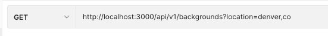

* example response

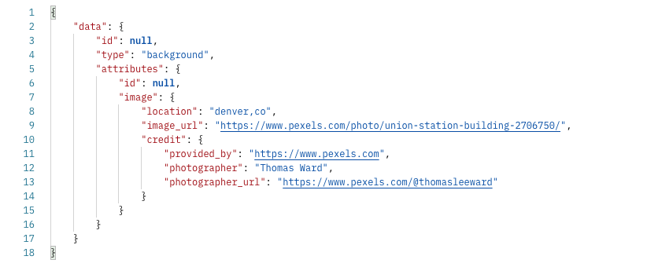

### create a user
creates a user in the database, stores a secure password, and returns an api_key for the user to use later, API key is unique and auto generated at user creation

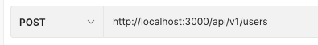

* body

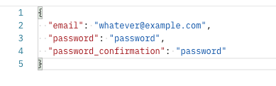

* expample response

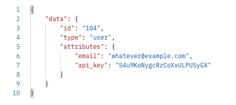

### log in a user
logs a user in and returns the api key for access to the api in other instances


* post body

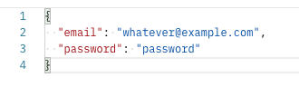

* example response

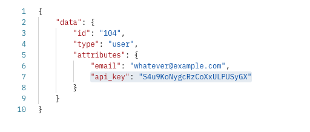

### take a trip
lets take a trip! returns travel time and weather expected at the destination city at the time of arrivial 

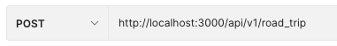

* body

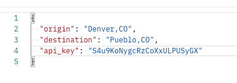

* example response

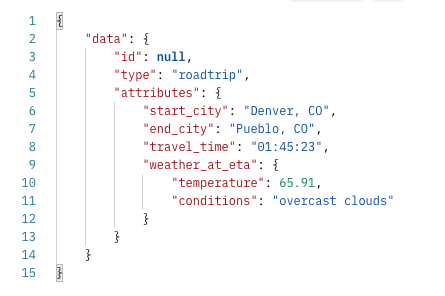
